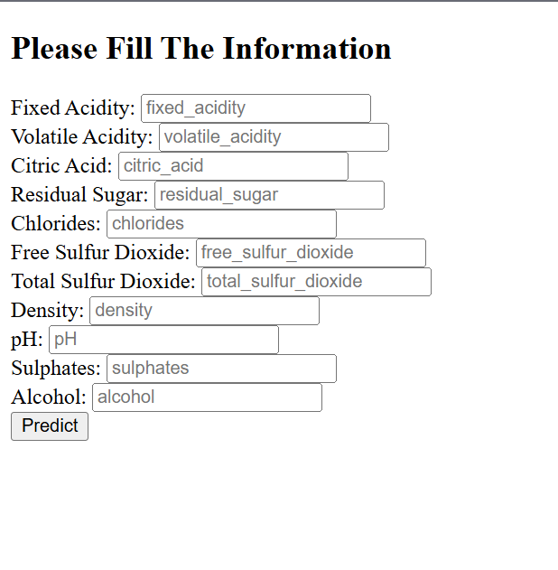

# 🍷 PilotProject: Wine Quality Prediction ML Pipeline

> 🚀 A modular ML pipeline for predicting wine quality with real-time Flask inference, MLflow experiment tracking, and Docker support. Built with clean code, YAML configs, and production-ready practices.

---


---

## 🚀 Features

* ✅ Modular pipeline architecture with CLI and UI interfaces
* ✅ YAML-based configuration for easy customization
* ✅ Data validation with schema enforcement
* ✅ ElasticNet regression model with configurable parameters
* ✅ MLflow tracking for metrics, parameters, and models
* ✅ Flask web UI with `/train` and `/predict` endpoints
* ✅ Docker support for containerized deployment
* ✅ Logs, metrics, and predictions are persisted

---

## 🗂️ Project Structure

```text
wine_quality_prediction/
├── app.py                    # Flask web server
├── main.py                   # Pipeline runner
├── config/                   # YAML configuration files
│   └── config.yaml
├── params.yaml               # Model hyperparameters
├── schema.yaml               # Column definitions
├── requirements.txt          # Python dependencies
├── Dockerfile                # Docker build instructions
├── logs/                     # All application logs
├── datasets/                 # Source datasets (zip)
├── artifacts/                # Output from each pipeline stage
│   ├── data_ingestion/
│   ├── data_validation/
│   ├── data_transformation/
│   ├── model_trainer/
│   ├── model_evaluation/
│   └── model_prediction/
├── mlruns/                   # MLflow tracking directory
├── templates/                # Flask HTML templates
│   ├── index.html
│   └── results.html
└── src/wine_quality_prediction/  # Main package
    ├── components/           # Stage logic (ingest, validate, train, etc.)
    ├── pipeline/             # Pipeline orchestration
    ├── config/               # Configuration manager
    ├── entity/               # Dataclasses for configs
    ├── constants/            # Path constants
    └── utils/                # Common utilities
```

---

## ⚙️ Configuration

All configuration is handled through YAML and `.env` files for clean, flexible pipeline control.

* Edit dataset paths, output directories, and URLs in:
  `config/config.yaml`

* Set model hyperparameters like `alpha`, `l1_ratio` in:
  `params.yaml`

* Define schema (column names and data types) in:
  `schema.yaml`

* Configure MLflow tracking URI and other secrets via `.env` file:

```dotenv
MLFLOW_TRACKING_URI=<your-mlflow-uri>
MLFLOW_TRACKING_USERNAME=<your-username>
MLFLOW_TRACKING_PASSWORD=<your-password>
```

---

## 🧪 How to Run the Project

Follow these steps to set up, train, and run the ML pipeline with both CLI and Web UI support.

### 🔧 Step 1: Clone the Repository

```bash
git clone https://github.com/megokul/wine_quality_prediction.git
cd wine_quality_prediction
```

### 📦 Step 2: Install Dependencies

```bash
pip install -r requirements.txt
```

### 🛠️ Step 3: Run the Training Pipeline

```bash
python main.py
```

This will:

* Ingest data
* Validate schema
* Split and transform data
* Train and evaluate ElasticNet model
* Log metrics and parameters to MLflow

### 🌐 Step 4: Launch the Flask Web App

```bash
python app.py
```

Visit: [http://localhost:8080](http://localhost:8080)

Use the UI to enter wine chemical attributes and receive quality predictions.

### 📊 Step 5: Launch MLflow UI (Optional)

```bash
mlflow ui
```

Then visit: [http://localhost:5000](http://localhost:5000)

You’ll be able to view:

* RMSE, MAE, R² metrics
* Logged parameters (`alpha`, `l1_ratio`)
* Saved models and input examples

---

## 🖼️ Demo

Here’s how the prediction UI looks:



---

## 🎯 Future Improvements

* Add CI/CD with GitHub Actions
* Add automated testing with `pytest`
* Extend model support (e.g., RandomForest, XGBoost)
* Enable remote model deployment (AWS/GCP)

---

## 🔗 Key Files

* [`main.py`](./main.py): Runs the full pipeline
* [`app.py`](./app.py): Flask app for prediction UI
* [`config/config.yaml`](./config/config.yaml): Data paths and directories
* [`params.yaml`](./params.yaml): ElasticNet model hyperparameters
* [`schema.yaml`](./schema.yaml): Data schema definition

---

## 👤 Author

**Gokul Krishna N V**
Machine Learning Engineer, UK
[GitHub](https://github.com/megokul) • [LinkedIn](https://www.linkedin.com/in/nv-gokul-krishna)

---

## 📄 License

Licensed under **GPLv3**.

---

## 🙌 Acknowledgements

* Dataset: [UCI Wine Quality Dataset](https://archive.ics.uci.edu/ml/datasets/wine+quality)
* Based on data hosted by [Krishnaik06’s GitHub](https://github.com/krishnaik06/datasets)
